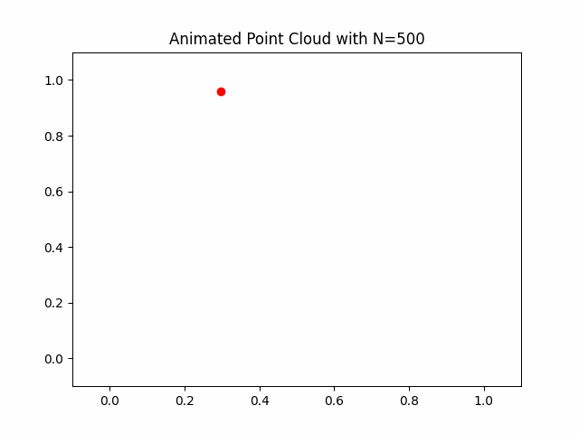

# Data Sets

## Dynamical2D 
Dynamical System Progression           |  System with varying $r$ values
:-------------------------:|:-------------------------:
  |  

Functions for generation and visualization of a 2-dimensional dynamical system in the unit square.
Example:
```
X,Y = GeneratePoints(N= 500, r=2.1, plot = True)
animate_r(rmin = 1.9, rmax = 2.3, N = 500, x0 = X[0], y0 = Y[0], steps = 500)
animate_X(r=2.1, N=500, x0=X[0],y0=Y[0]):
```

- `GeneratePoints`:<br>
Generate a set of points in $[0,1]\times [0,1]$ defined by the dynamical system :
$$
x_{n+1} = x_n + r(1-y_n) \mod{1}
$$
$$
y_{n+1} = y_n + r(1-x_n) \mod{1}
$$
where $(x_0, y_0)$ and $r$ is given. If `x0` and/or `y0`, is not specified, then they are initialized to random values.<br>
- `animate_r`: <br>
Animate the dynamical system with fixed initial conditions and varying $r$ values.
- `animate_X`: <br>
Animate the sequence $(x_n,y_n)_{n=0} ^{N-1}$ 
